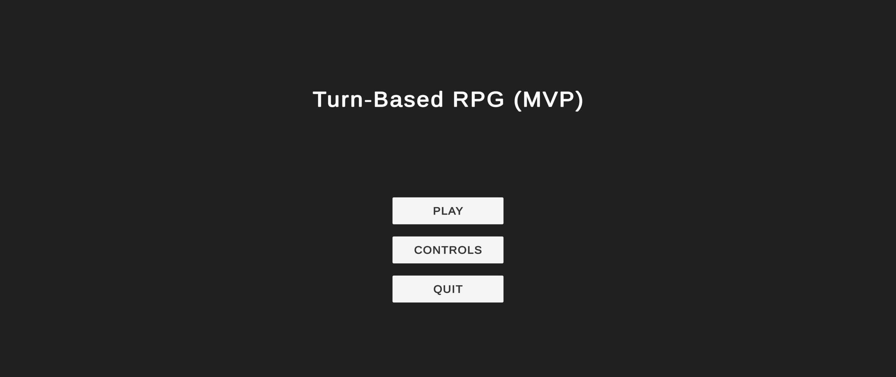
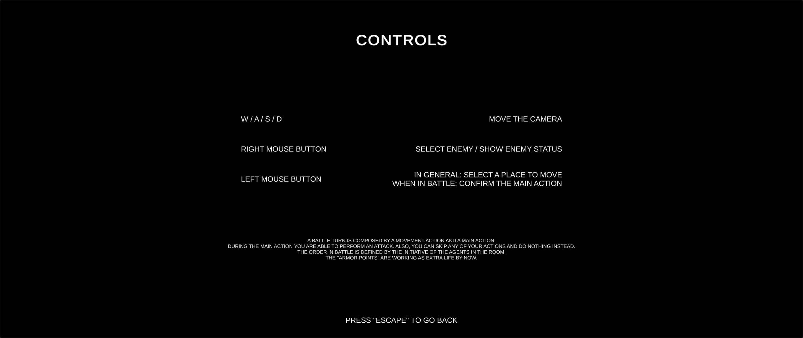
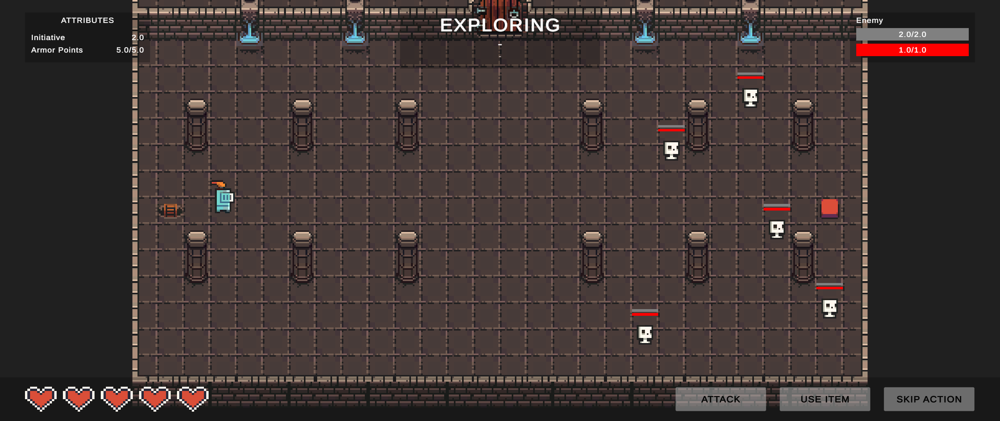
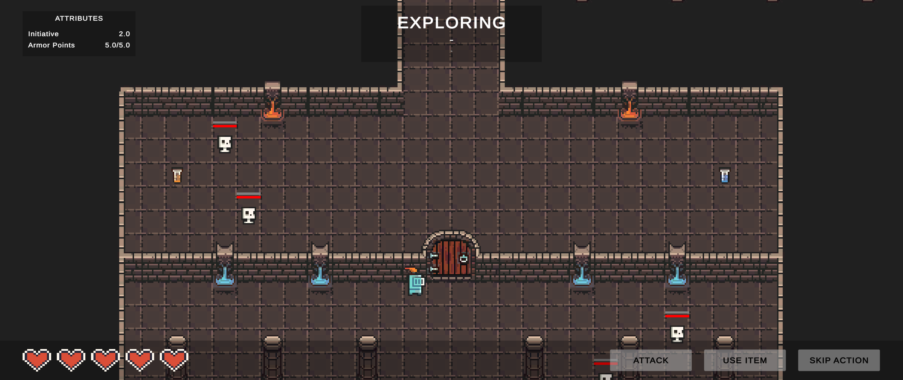
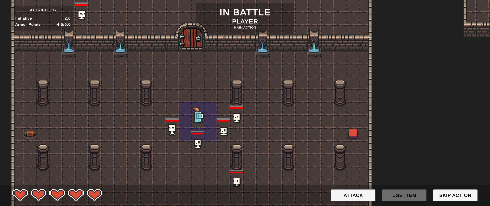

# Turn-Based RPG (MVP)

A simple 2D turn-based role-playing game (RPG), where the player has to explore a dungeon and fight with monsters to survive.

The current version is just a minimum viable product (MVP) of the game, with some core mechanics implemented.

## About

The game has two global states: **exploring mode** and **in-battle mode**. When exploring, the player can move freely over the map. But, the moment the player is seen by an enemy, a battle is started with all agents in the room.

In the battle, each agent has his turn to play. A battle turn is composed of a **movement action** and a **main action**.

- During the movement action, the agent can move a limited amount of cells.
- During the main action, the agent is able to perform a predefined attack action.
- Also, agents can skip any of their actions and do nothing instead.

Their initiatives define the order of agents in battle.

> The game movement system restricts the agents' movement into a grid. The grid carries the information of all cells which can be navigated and/or reached. An agent can select some viable cell on the grid and the game will calculate the best path to reach it (using an **A\*** algorithm).

When all enemies in the room are dead, the player can pass through a button to open the room's door and move to the next one.

## Gallery

Exploring Mode

In-Battle Mode

# Credits

The game is beeing developed using the art provided by the pack [DUNGEON TILESET II](https://0x72.itch.io/dungeontileset-ii).

# Builds

A Windows build is available on [itch.io](https://zille.itch.io/2d-turn-based-rpg).
